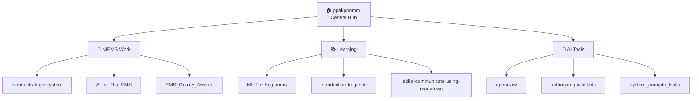

# 👋 สวัสดีครับ ผม Pakpoom (ppakpoomm)

**Monitoring & Evaluation** · สถาบันการแพทย์ฉุกเฉินแห่งชาติ (NIEMS) · นนทบุรี 🇹🇭

---

## 🧭 พื้นที่ทำงานกลาง (Central Workspace)

รีโปนี้คือ **ศูนย์กลาง** สำหรับจัดการและเชื่อมโยงโปรเจกต์ทั้งหมดของผม  
ดูรายละเอียดเพิ่มเติมได้ที่ [docs/WORKSPACE.md](docs/WORKSPACE.md) · แคตตาล็อกเครื่องอ่านได้: [repos.json](repos.json)

---

## 🏥 NIEMS — งานหลัก

| รีโป | สถานะ | ภาษา | คำอธิบาย |
|------|--------|------|----------|
| [**niems-strategic-system**](https://github.com/ppakpoomm/niems-strategic-system) | 🟢 Active | Python | ระบบวางแผนยุทธศาสตร์ — Forensic XLSM Analysis & Blueprint (Phase A ✅) |
| [**AI-for-Thai-EMS**](https://github.com/ppakpoomm/AI-for-Thai-EMS) | 🟢 Active | TypeScript | แอป AI สำหรับระบบการแพทย์ฉุกเฉินไทย (NIEMS_2569) |
| [**EMS_Quality_Awards**](https://github.com/ppakpoomm/EMS_Quality_Awards) | 🟢 Active | Python | ติดตาม อปท.มาตรฐาน 2569 — [projects/](projects/EMS_Quality_Awards/) |

---

## 📚 การเรียนรู้

| รีโป | สถานะ | ภาษา | คำอธิบาย |
|------|--------|------|----------|
| [**ML-For-Beginners**](https://github.com/ppakpoomm/ML-For-Beginners) | 🟢 Active | Jupyter | 12 สัปดาห์ Machine Learning (fork จาก Microsoft) |
| [**introduction-to-github**](https://github.com/ppakpoomm/introduction-to-github) | ✅ Done | — | หลักสูตร GitHub Skills แรก |
| [**skills-communicate-using-markdown**](https://github.com/ppakpoomm/skills-communicate-using-markdown) | 🟡 In Progress | — | หลักสูตร Markdown บน GitHub Skills |

---

## 🤖 เครื่องมือ AI

| รีโป | สถานะ | ภาษา | คำอธิบาย |
|------|--------|------|----------|
| [**openclaw**](https://github.com/ppakpoomm/openclaw) | 🟢 Active | TypeScript | Personal AI assistant — Any OS, Any Platform 🦞 |
| [**anthropic-quickstarts**](https://github.com/ppakpoomm/anthropic-quickstarts) | 📖 Reference | Python | โปรเจกต์เริ่มต้นสำหรับ Anthropic API |
| [**system_prompts_leaks**](https://github.com/ppakpoomm/system_prompts_leaks) | 📖 Reference | JavaScript | คอลเลกชัน System Prompts (ChatGPT, Claude, Gemini) |

---

## 💡 เกี่ยวกับผม

ผมทำงานด้าน **Monitoring & Evaluation** ที่สถาบันการแพทย์ฉุกเฉินแห่งชาติ (NIEMS)  
สนใจยุทธศาสตร์และการบริหารโครงการ, การตัดสินใจด้วยข้อมูล, และการเรียนรู้ตลอดชีวิต  
ชอบใช้ข้อมูลและเทคโนโลยีเพื่อพัฒนาระบบสาธารณสุขและการแพทย์ฉุกเฉิน

### ผลงานที่ภูมิใจ
- นำโปรเจกต์วิเคราะห์ข้อมูลเพื่อปรับปรุงการตอบสนองทางการแพทย์ฉุกเฉิน
- พัฒนากลยุทธ์ Monitoring & Evaluation ที่มีประสิทธิภาพในด้านสาธารณสุข
- แบ่งปันความรู้ด้านการบริหารโครงการและ Data Visualization กับเพื่อนร่วมงานและชุมชน

---

## 🚀 Quick Start

| ต้องการทำอะไร | ไปที่ |
|--------------|-------|
| ดูระบบยุทธศาสตร์ NIEMS | [niems-strategic-system](https://github.com/ppakpoomm/niems-strategic-system) |
| รันแอป AI สำหรับ EMS | [AI-for-Thai-EMS](https://github.com/ppakpoomm/AI-for-Thai-EMS) → `npm install && npm run dev` |
| เรียน Machine Learning | [ML-For-Beginners](https://github.com/ppakpoomm/ML-For-Beginners) |
| ติดตาม อปท. มาตรฐาน 2569 | [projects/EMS_Quality_Awards](projects/EMS_Quality_Awards/) → `make serve` |
| ดูแผนผังพื้นที่ทำงานทั้งหมด | [docs/WORKSPACE.md](docs/WORKSPACE.md) |

---

## 🤝 ติดต่อและร่วมงาน

- 🐙 GitHub: [@ppakpoomm](https://github.com/ppakpoomm)
- 🐦 Twitter: [@ppak_poom](https://twitter.com/ppak_poom)
- 🏢 NIEMS: [www.niems.go.th](https://www.niems.go.th)
- 💬 เปิด Issue ในรีโปที่เกี่ยวข้อง หรือส่งข้อความมาได้เลยครับ

---

**ขอบคุณที่แวะมาครับ — มาเรียนรู้และสร้างสิ่งดี ๆ ไปด้วยกัน 🚀**

*อัปเดตล่าสุด: กรกฎาคม 2026 · [repos.json](repos.json)*

